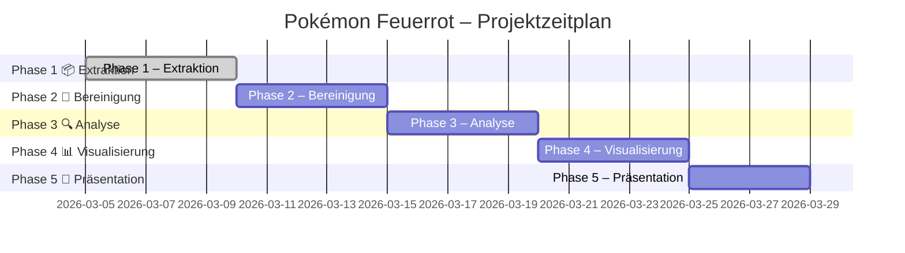

# 🎮 Pokémon Feuerrot – Data Science Analyse

Dieses Projekt analysiert die ROM-Daten von **Pokémon Feuerrot (BPRD – Deutsche Version)** mit einem vollständigen Data-Science-Workflow:
Extraktion → Bereinigung → Analyse → Visualisierung

> Privates Projekt im Bereich **Data Science / Analyse**

---

## 🎯 Projektziel

Anhand der Rohdaten aus der Pokémon Feuerrot ROM sollen folgende Fragen beantwortet werden:

- Welche Pokémon-Typen dominieren das Spiel?
- Welche Pokémon sind statistisch am stärksten?
- Ist das Spiel fair ausbalanciert?
- Welche Typen sind offensiv/defensiv am vorteilhaftesten?
- Sind seltene Pokémon wirklich selten?

---

## 🗂️ Projektstruktur

```
Pokemon_Firered_Analysis/
│
├── data/                  # Extrahierte Rohdaten (CSV) – nicht im Git!
├── notebooks/             # Jupyter Notebooks
│   └── 01_extraktion.ipynb
├── visualizations/        # Exportierte Grafiken & Charts
├── requirements.txt       # Python-Abhängigkeiten
└── README.md
```

---

## ⚙️ Setup

### 1. Conda-Umgebung erstellen

```bash
conda create -n pokemon-analysis python=3.11
conda activate pokemon-analysis
```

### 2. Pakete installieren

```bash
pip install -r requirements.txt
```

### 3. Jupyter starten

```bash
jupyter notebook
```

---

## 📦 Verwendete Bibliotheken

| Bibliothek | Zweck |
|---|---|
| `pandas` | Datenverarbeitung |
| `numpy` | Numerische Berechnungen |
| `matplotlib` | Basis-Visualisierungen |
| `seaborn` | Statistische Grafiken |
| `plotly` | Interaktive Visualisierungen |
| `streamlit` | Interaktives Dashboard (optional) |
| `jupyter` | Notebook-Umgebung |

---

## 🗺️ Ablaufplan & Fortschritt

### Die folgende Roadmap wurde mit Claude.ai erstellt, spontane Anpassungen sind möglich.

### Phase 1 – Extraktion 📦
**Ziel:** Rohdaten aus der ROM in nutzbare Formate überführen

| Schritt | Aufgabe                                                    | Tool | Status |
|---------|------------------------------------------------------------|---|---|
| 1.1     | Projektumgebung einrichten (Python, Jupyter, venv)         | `pip`, `conda` | ✅ Fertig |
| 1.2     | ROM-Struktur verstehen (Hex-Offsets, Datenblöcke)          | Dokumentation / PokeMap | ✅ Fertig |
| 1.3a    | Pokémon-Namen extrahieren                                  | `Python struct` / `pokemontools` | ✅ Fertig |
| 1.3b    | Pokémon-Basiswerte extrahieren (HP, ATK, DEF, …)           | `Python struct` / `pokemontools` | ⏳ Offen |
| 1.4     | Move-Daten extrahieren (Stärke, Genauigkeit, Typ)          | `Python struct` | ⏳ Offen |
| 1.5     | Encounter-Tabellen extrahieren (wo, welches Pokémon, wie oft) | `Python struct` | ⏳ Offen |
| 1.6     | Rohdaten als CSV speichern                                 | `pandas` | ⏳ Offen |

### Phase 2 – Bereinigung 🧹
**Ziel:** Daten konsistent, vollständig und analysierbar machen

| Schritt | Aufgabe | Status |
|---|---|---|
| 2.1 | Fehlende oder fehlerhafte Werte identifizieren | ⏳ Offen |
| 2.2 | Datentypen korrigieren (z.B. Typ-IDs → Typnamen) | ⏳ Offen |
| 2.3 | Duplikate entfernen | ⏳ Offen |
| 2.4 | Tabellen sinnvoll verknüpfen (z.B. Pokémon ↔ Moves ↔ Encounters) | ⏳ Offen |
| 2.5 | Bereinigtes Dataset als neues CSV abspeichern | ⏳ Offen |

### Phase 3 – Analyse 🔍
**Ziel:** Muster, Zusammenhänge und Auffälligkeiten finden

| Schritt | Fragestellung | Status |
|---|---|---|
| 3.1 | Typverteilung – Welche Typen dominieren? Gibt es Lücken? | ⏳ Offen |
| 3.2 | Stärke-Ranking – Welche Pokémon haben die höchsten Gesamtwerte? | ⏳ Offen |
| 3.3 | Stat-Korrelation – Korrelieren z.B. Angriff und Speed? | ⏳ Offen |
| 3.4 | Encounter-Analyse – Sind seltene Pokémon wirklich selten? | ⏳ Offen |
| 3.5 | Typen-Matchup-Matrix – Welcher Typ ist am stärksten / schwächsten? | ⏳ Offen |
| 3.6 | Balancing-Check – Ist das Spiel fair designt? | ⏳ Offen |

### Phase 4 – Visualisierung 📊
**Ziel:** Ergebnisse anschaulich und präsentierbar machen

| Schritt | Visualisierung | Tool | Status |
|---|---|---|---|
| 4.1 | Balkendiagramm der Typverteilung | `matplotlib` | ⏳ Offen |
| 4.2 | Heatmap der Typ-Matchups | `seaborn` | ⏳ Offen |
| 4.3 | Radar-Charts für Pokémon-Stats | `plotly` | ⏳ Offen |
| 4.4 | Top-10 Pokémon nach Gesamtstärke | `seaborn` | ⏳ Offen |
| 4.5 | Encounter-Karte pro Route | `plotly` | ⏳ Offen |
| 4.6 | Interaktives Dashboard (optional) | `streamlit` | ⏳ Offen |

### Phase 5 – Präsentation 🎤
**Ziel:** Projekt dokumentieren und vorstellen

| Schritt | Aufgabe | Status |
|---|---|---|
| 5.1 | Jupyter Notebook aufräumen & kommentieren | ⏳ Offen |
| 5.2 | README.md schreiben | ⏳ Offen |
| 5.3 | Kernaussagen formulieren: „Was habe ich herausgefunden?" | ⏳ Offen |
| 5.4 | Präsentation erstellen (optional: Streamlit-App als Live-Demo) | ⏳ Offen |

---

## 📅 Projektzeitplan



---

## 📝 Ergebnisse & Erkenntnisse

> *Wird nach Abschluss der Analyse ergänzt.*

---

## ⚠️ Hinweise

- Die ROM-Datei (`*.gba`) ist **nicht** Teil dieses Repositories
- Alle Offsets beziehen sich auf die **deutsche Version (Game Code: BPRD)**
